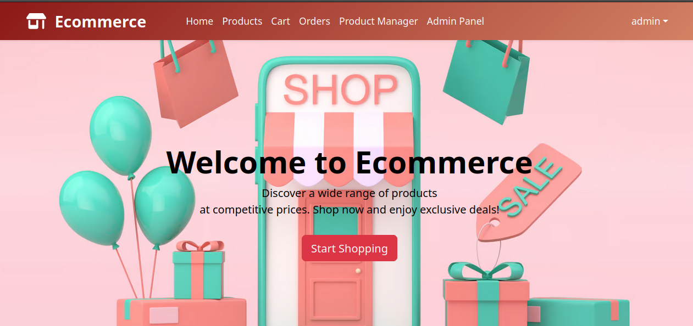
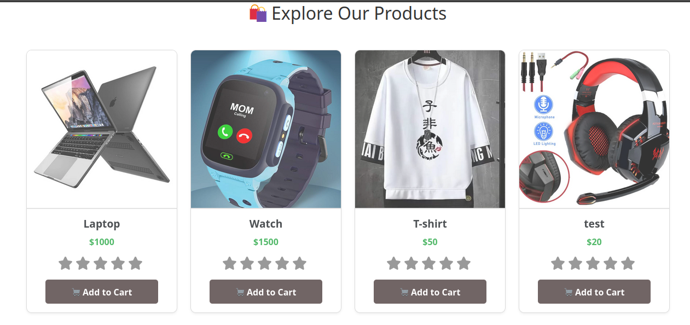
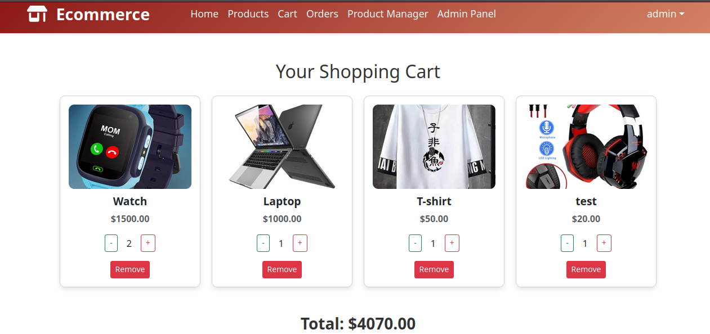
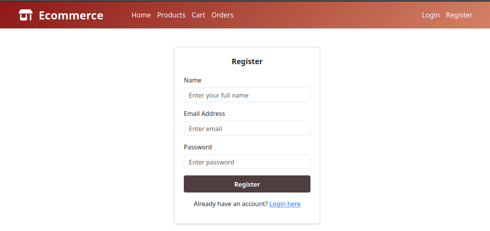
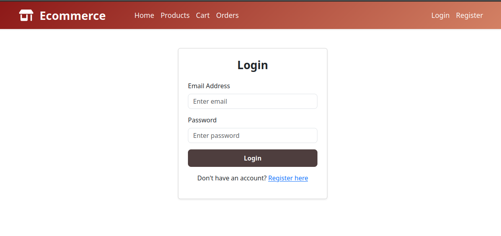
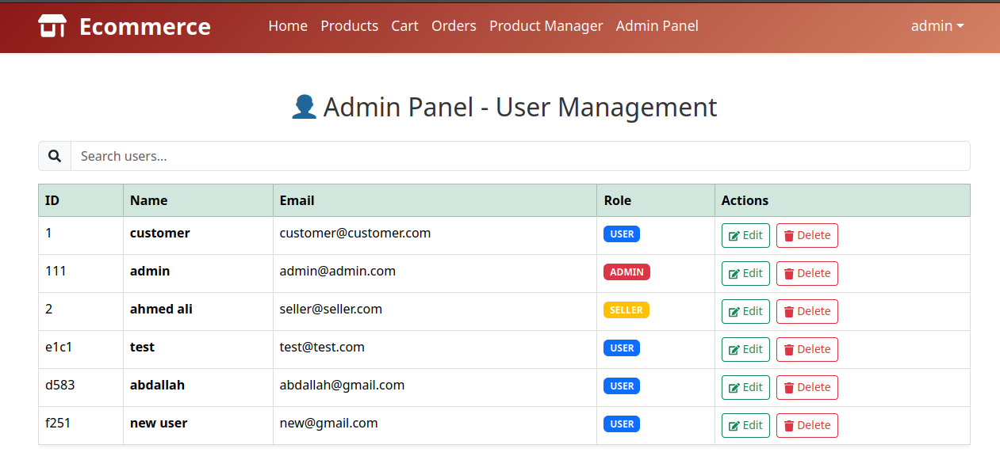
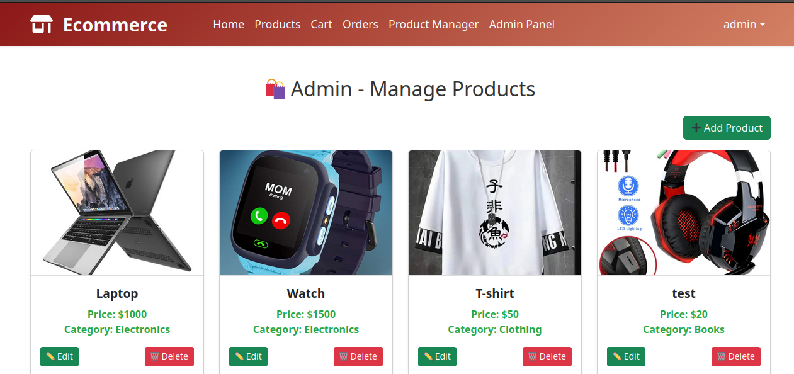
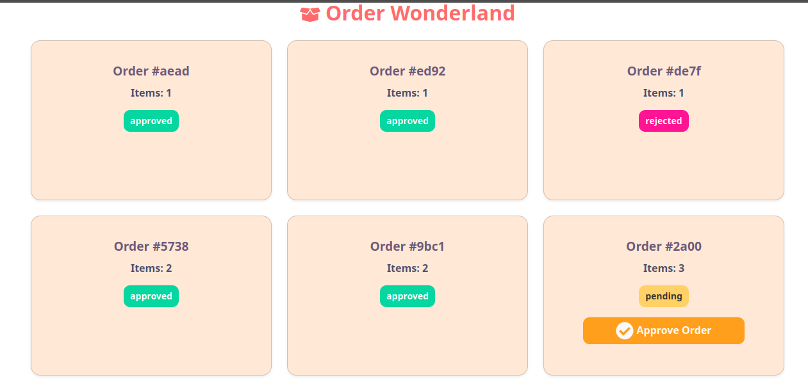

# Ecommerce Application

## Project Overview



This **Ecommerce Application** is part of the **ITI (Information Technology Institute) Diploma** curriculum. It demonstrates a full-stack e-commerce platform built using modern web development technologies, including React.js, Redux, JSON Server, and React-Bootstrap. The application allows users to browse products, add items to their cart, register/login, and manage orders. Additionally, it includes an admin panel for managing users and products.

### Here is a Video that explain the project => [Link](https://drive.google.com/file/d/16nXo4LWxUL9yqMFX3qgi1HaWyGKzYMH1/view?usp=sharing)
---

## Table of Contents

- [Project Features](#project-features)
- [How to Clone and Run the Project](#how-to-clone-and-run-the-project)
- [Technologies Used](#technologies-used)

---

## Project Features

The application provides the following functionalities:

### User Features
- **Home Page**: Displays a hero section, slider, and categories to guide users.
- **Product Listing**:
  - View a list of all available products.
  - Filter products by category.
  - Search for products by name.


- **Product Details**:
  - Click on a product to view detailed information (e.g., name, price, description, image).
- **Cart Management**:
  - Add products to the cart.
  - Update quantities or remove items from the cart.
  - Proceed to checkout and place an order.


    
- **Authentication**:
  - Register as a new user.
    


  - Log in with registered credentials.
   

  
  - Log out securely.
  

### Admin Features
- **Admin Panel**:
  - Accessible only to users with the `admin` role.
  - Manage users: View, edit, and delete user accounts.





- **Product Manager**:
  - Accessible only to users with the `admin` or `seller` role.
  - Add new products.
  - Edit or delete existing products.



### Order Management
- Users can place orders from their cart.
- Sellers can approve pending orders.



---

## How to Clone and Run the Project

Follow these steps to clone and run the project locally:

### Prerequisites
- Node.js (v14 or higher): [Download Node.js](https://nodejs.org/)
- npm (comes with Node.js): Verify installation by running `npm -v` in your terminal.
- Git: [Download Git](https://git-scm.com/)

### Step 1: Clone the Repository
Run the following command in your terminal to clone the repository:
```bash
1. git clone https://github.com/Abdallah-Ali247/ITI-React-Ecommerce.git
2. cd ITI-React-Ecommerce
3. npm install
4. cd Server
5. npm install -g json-server
6. json-server --watch db.json --port 5000
7. cd .. && cd Ecommerce
8. npm start or npm run dev
```
---
# Technologies Used
`React`, `Redux`, `Js`, `BootStrab`, `json server`, `HTML`, `CSS`  
